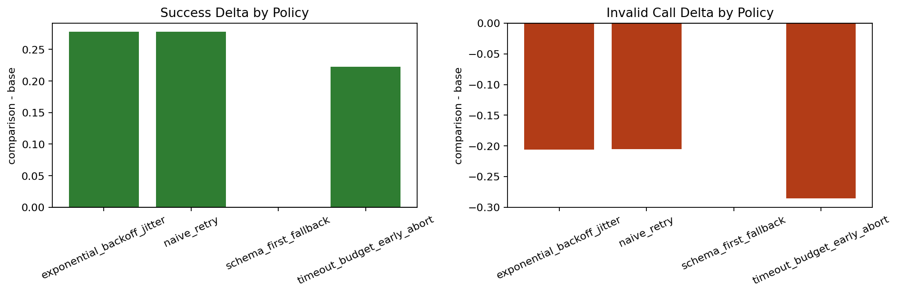
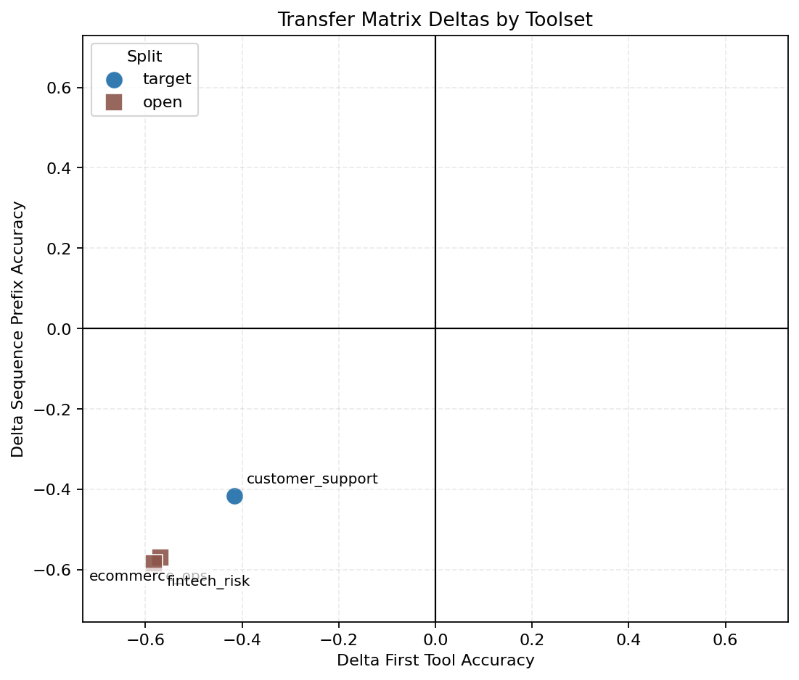

# Tool-Calling Reliability Benchmark

Tool-Calling Reliability Benchmark (TCRB) is a fault-injection benchmark for tool-calling agents and planners. The point of the repo is not just to run tasks. It is to answer a harder question: when a planner looks better, is that a real reliability improvement, or just noise, overfitting, or metric blindness?

This repository is organized around two deliverables:

- reproducible reliability measurements under controlled failures
- interpretable evidence that distinguishes real gains from flat or regressive changes

Detailed success criteria live in `docs/core-goals.md`.

## What This Repo Has Achieved

TCRB already demonstrates an end-to-end evaluation loop with checked-in artifacts:

- controlled failure benchmarking across timeout, rate-limit, malformed-schema, contract-drift, and network-failure conditions
- multi-seed aggregation so comparisons are not based on a single lucky run
- pairwise delta reports that show exactly how a comparison planner moved core metrics
- transfer-matrix checks that ask whether target improvements generalize or collapse off-target
- study-gate checks that fail flatline experiments and surface regressions explicitly

The important outcome is methodological, not cosmetic: this repo can prove when an apparent improvement is real, and it can also prove when that improvement does not transfer.

## Representative Outcome

One checked-in entrypoint run shows the benchmark doing exactly what it is supposed to do: detect a meaningful in-domain improvement while also catching transfer failure.

Source artifacts:

- `runs/entrypoint-core-20260403-192104-base-ms/multi_seed_summary.md`
- `runs/entrypoint-core-20260403-192104-comparison-ms/multi_seed_summary.md`
- `runs/entrypoint-core-20260403-192104-delta/delta-ms.md`
- `runs/entrypoint-core-20260403-192104-matrix/matrix_summary.md`
- `runs/entrypoint-core-20260403-192104-study-gate/study_gate.md`

### Outcome Snapshot

| signal | result | why it matters |
|---|---:|---|
| mean target success delta | +0.1944 | comparison planner improved task success on the target workload |
| mean target invalid-call delta | -0.1743 | invalid tool calls dropped materially |
| study-gate verdict | PASS | the change is observably non-flat and therefore measurable |
| transfer-matrix portfolio verdict | FAIL | the same change does not generalize across toolsets |
| max absolute matrix delta | 0.5833 | transfer regression is large enough to be obvious, not marginal |

That is the intended behavior of the benchmark. It does not merely reward a bigger target metric. It separates:

- target improvement
- signal existence
- transfer robustness

In this run, the comparison planner improved several target-workload policies substantially:

- `exponential_backoff_jitter`: success +0.2778, invalid calls -0.2063
- `naive_retry`: success +0.2778, invalid calls -0.2050
- `timeout_budget_early_abort`: success +0.2222, invalid calls -0.2857

At the same time, transfer degraded sharply:

- `customer_support` target delta: first-tool -0.4167, sequence -0.4167
- `ecommerce_ops` open delta: first-tool -0.5694, sequence -0.5694
- `fintech_risk` open delta: first-tool -0.5833, sequence -0.5833

So the benchmark is already doing useful scientific work: it can show a planner got better on one slice while getting worse as a general policy.

## Visual Evidence

The repo includes a notebook that walks through the core outcome flow and renders plots from a checked-in run:

- `notebooks/entrypoint_outcomes.ipynb`

Static versions of two of those plots are included below for quick inspection.

### Delta by Policy



### Transfer Matrix



The combination matters more than either chart alone: the first figure shows genuine target-side improvement, while the second makes the transfer failure impossible to miss.

## Methodology

TCRB evaluates planners in layers.

### 1. Run Under Controlled Faults

Policies are exercised against workloads where failures are injected deliberately rather than observed opportunistically. The benchmark makes tradeoffs visible across:

- task success rate
- invalid tool-call rate
- latency
- retries per success
- cost per success

### 2. Aggregate Across Seeds

Single-run results are too brittle for claims about reliability. Multi-seed runs produce confidence-bounded summaries and reduce the chance of over-reading variance.

### 3. Compare Base vs Comparison Directly

Delta reports compute `comparison - base` on the same workload so improvement and regression are explicit rather than inferred from separate tables.

### 4. Check Transfer Instead of Only Target Fit

Transfer-matrix runs compare target-toolset behavior with open-toolset behavior. This is where over-specialization shows up.

### 5. Gate on Signal Quality

Study-gate checks exist to prevent weak claims. They catch flatline deltas, missing matrix movement, and other cases where a run should not be treated as evidence.

## Artifact Model

The repo writes human-readable outputs under `runs/<label>/`.

| artifact | purpose |
|---|---|
| `result.json`, `summary.md` | single-run benchmark outputs |
| `multi_seed.json`, `multi_seed_summary.md` | aggregate metrics across seeds |
| `delta-ms.json`, `delta-ms.md` | base-vs-comparison metric deltas |
| `matrix.json`, `matrix_summary.md` | transfer and generalization behavior |
| `study_gate.json`, `study_gate.md` | pass/fail signal validation |

If a result matters, it should be visible in both JSON and markdown without manual interpretation.

## Minimal Reproduction

Setup is intentionally small. The benchmark is useful only if results are easy to reproduce from checked-in configs.

```bash
uv sync --extra dev
uv run pytest
```

Fastest end-to-end paths:

```bash
uv run python scripts/run_northstar_hf.py
```

```bash
uv run tcrb multi-seed --config configs/baseline.json --workload workloads/sample_tasks.json --seeds 1,2,3 --label ms-baseline
```

```bash
uv run tcrb eval-delta --base-run runs/ms-base/multi_seed.json --comparison-run runs/ms-comparison/multi_seed.json --output-json runs/ms-comparison/delta-ms.json --output-report runs/ms-comparison/delta-ms.md
```

```bash
uv run python scripts/run_transfer_matrix.py --manifest workloads/enriched/manifest.json --config configs/baseline.json --base-planner-config configs/planners/policy_native.json --comparison-planner-config configs/planners/heuristic.json --target-toolset customer_support --max-tasks 0 --label matrix-example
```

```bash
uv run tcrb study-gate --base-run runs/ms-base/multi_seed.json --comparison-run runs/ms-comparison/multi_seed.json --matrix-json runs/matrix-example/matrix.json --require-matrix-signal --output-json runs/ms-comparison/study_gate.json --output-report runs/ms-comparison/study_gate.md
```

If you want the compact walkthrough rather than raw CLI steps, open `notebooks/entrypoint_outcomes.ipynb`.

## Planner Types

- `policy_native`
- `heuristic`
- `stochastic`
- `replay`
- `command`
- `hf_local`
