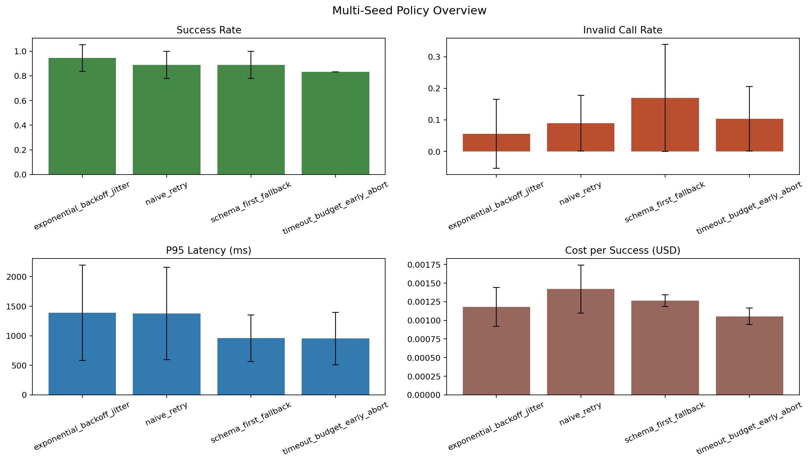
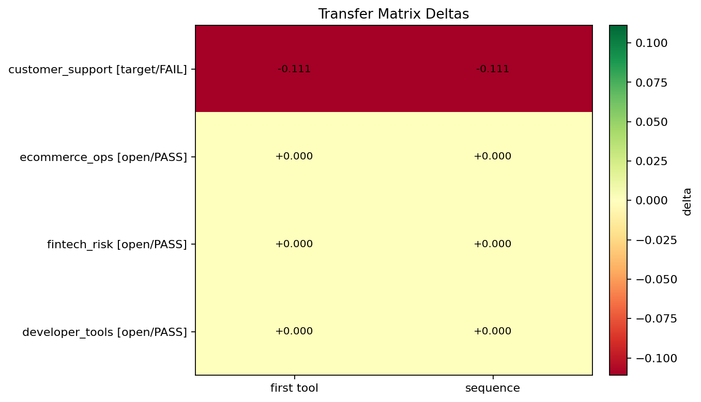

# Tool-Calling Reliability Benchmark

Tool-Calling Reliability Benchmark (TCRB) is a benchmark-and-repair workflow for tool-routing reliability.

It is built to answer a stricter question than "did the score go up?":

If we repair a planner so it chooses the right tool more often on the target workload, does that improvement survive under controlled failures, across multiple seeds, and across other toolsets?

Detailed project criteria live in `docs/core-goals.md`.

Artifact bundle: https://doi.org/10.5281/zenodo.20071002

## Current v0.2 Study

The current failure-recovery study is documented in [`reports/v02/README.md`](reports/v02/README.md). It evaluates Qwen3-4B under clean tasks and five controlled tool-failure types, with transfer to unseen domains and hazards.

## Headline Result

The strongest result in this repo is a targeted router-repair run on a real HF planner:

- base model: `Qwen/Qwen2.5-3B-Instruct`
- repair step: DPO on a small first-tool preference dataset
- training set size: `157` preference rows
- target domain: `customer_support`

### What improved

| signal | base | repaired | delta |
|---|---:|---:|---:|
| target success across seeds `11,13,17` | `0.8333` | `0.9074` | `+0.0741` |
| invalid tool-call rate | `0.1367` | `0.0719` | `-0.0649` |
| target first-tool accuracy (`customer_support`) | `0.8333` | `1.0000` | `+0.1667` |

### What did not transfer cleanly

| toolset | base first-tool acc | repaired first-tool acc | delta |
|---|---:|---:|---:|
| `customer_support` | `0.8333` | `1.0000` | `+0.1667` |
| `ecommerce_ops` | `1.0000` | `0.8889` | `-0.1111` |
| `fintech_risk` | unchanged | unchanged | `0.0000` |
| `developer_tools` | unchanged | unchanged | `0.0000` |

## Why This Matters

- the repair fixed the specific failure mode it targeted
- the gain replicated across multiple seeds, not one lucky run
- invalid calls dropped while success rose—the operational direction that matters
- the benchmark surfaced the transfer limit rather than hiding it, which is what a reliability benchmark is supposed to do

What this repo shows:

1. a small targeted repair can measurably improve first-tool routing on a real workload
2. that gain holds up under stricter methodology than a single benchmark score
3. transfer must be measured explicitly—target improvement and cross-domain robustness are separate properties

## What TCRB Actually Does

TCRB combines four pieces:

- controlled workload execution with injected failures
- baseline-vs-comparison evaluation
- multi-seed aggregation
- transfer checks across multiple toolsets

The repo supports both:

- benchmark-only studies with built-in planners such as `policy_native` and `heuristic`
- HF-backed studies with `hf_local`, including adapter-backed comparisons and targeted repair runs

## Methodology

The methodology is intentionally conservative.

### 1. Targeted task signal

We measure whether the comparison planner improves the first tool it selects and whether task success also improves.

### 2. Error quality

We track invalid tool calls directly, so a planner does not get credit for reaching higher success through noisier behavior.

### 3. Multi-seed evaluation

We aggregate across seeds to reduce the chance that one favorable run becomes the entire story.

### 4. Transfer checks

We test the same change on multiple toolsets:

- `customer_support`
- `ecommerce_ops`
- `fintech_risk`
- `developer_tools`

That is what turns a local win into a meaningful reliability claim, or shows where the claim stops.

## Repo Outputs

The stable artifacts under `runs/<label>/` are:

| artifact | purpose |
|---|---|
| `summary.md`, `result.json` | one planner on one workload |
| `multi_seed_summary.md`, `multi_seed.json` | aggregated behavior across seeds |
| `delta-ms.md`, `delta-ms.json` | direct comparison between base and repaired planner |
| `matrix_summary.md`, `matrix.json` | transfer behavior across toolsets |
| `analysis_summary.md` | compact artifact-first summary with nearby visuals |

If you want one place to start, open:

- `runs/study-heuristic-vs-native-analysis/analysis_summary.md` for the benchmark harness story
- the Zenodo artifact bundle above for the latest end-to-end repair bundle

## Benchmark Foundation

Before the HF router-repair result, this repo already established the harness on built-in planners.

That earlier work matters because it validated the reporting loop, transfer matrix, and study-gate logic before using the same framework on a real HF planner.

Two representative visuals from that benchmark foundation:





Those figures are from the benchmark-only path, not from the later HF repair run, but they show the same reliability framing the repo now applies to LLM-backed planner studies.

## What Changed In The Repo

The repo now includes the full execution path for the HF repair workflow:

- strict HF planner configs with explicit candidate-scope controls
- adapter-backed planner comparisons
- direct first-tool probe and matrix scripts
- DPO dataset construction for router repair
- Kaggle packaging and execution helpers for GPU-backed runs
- training-side fixes for adapter continuation and DPO argument compatibility

Key files:

- `src/tcrb/hf_planner.py`
- `src/tcrb/research.py`
- `scripts/run_northstar_hf.py`
- `scripts/run_hf_choice_probe.py`
- `scripts/run_hf_choice_matrix.py`
- `scripts/build_router_dpo_dataset.py`
- `scripts/kaggle_tcrb.py`
- `kaggle/runner.py`

## Minimal Workflows

Most of the old command wall is not needed day to day. These are the only workflows worth surfacing.

### 1. Local sanity and tests

```bash
uv sync --extra dev
uv run pytest
```

### 2. Strict HF comparison

Use this when you want a clean base-vs-adapter first-tool study with explicit candidate controls:

```bash
uv run python scripts/run_northstar_hf.py --base-planner-config configs/planners/hf_qwen2_5_3b_base_taskscope_strict.json --comparison-planner-config configs/planners/hf_qwen2_5_3b_comparison_taskscope_strict.json --skip-matrix --run-study-gate --run-summarize
```

### 3. Kaggle-backed repair run

Use this when you want the GPU execution path:

```bash
uv run python scripts/kaggle_tcrb.py dataset-version
uv run python scripts/kaggle_tcrb.py push
uv run python scripts/kaggle_tcrb.py watch
uv run python scripts/kaggle_tcrb.py output --output-dir outputs/kaggle
```

## Extending The Repo

If you want to extend planners or add new workloads, start with:

- `configs/planners/minimal.json`
- `examples/custom_planner_minimal.py`
- `docs/extending-planners.md`

Current planner families:

- `policy_native`
- `heuristic`
- `minimal`
- `stochastic`
- `replay`
- `command`
- `hf_local`
