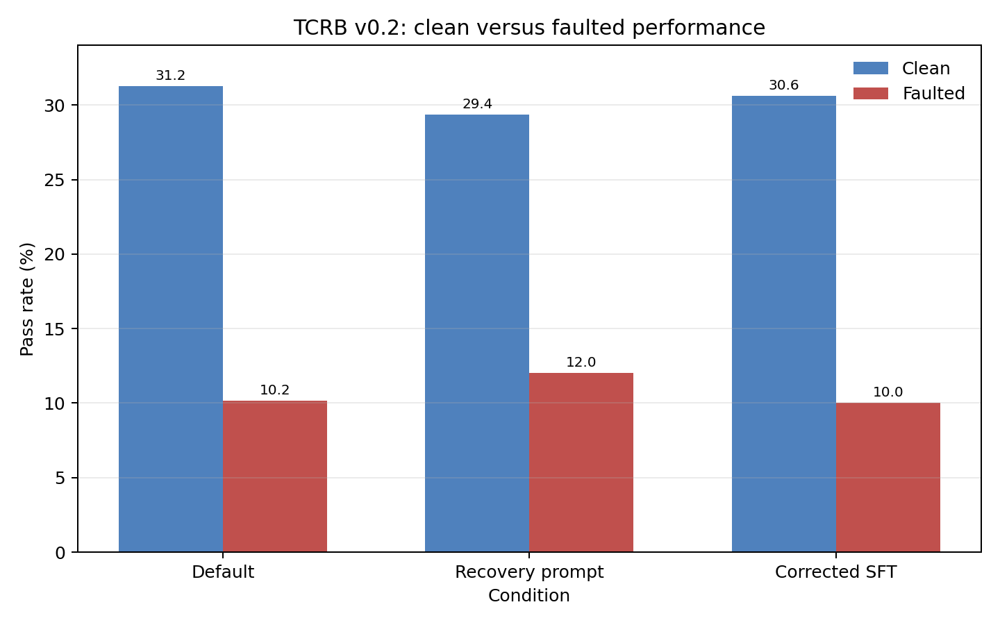
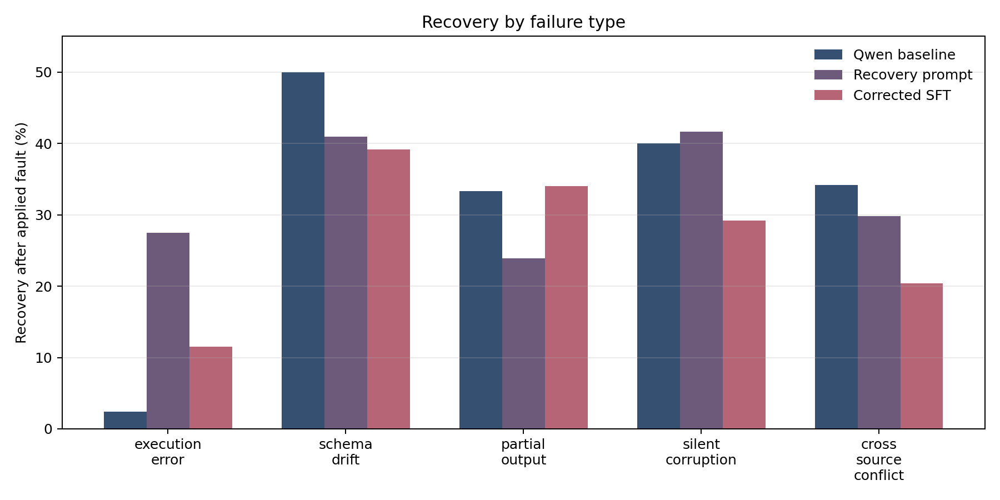
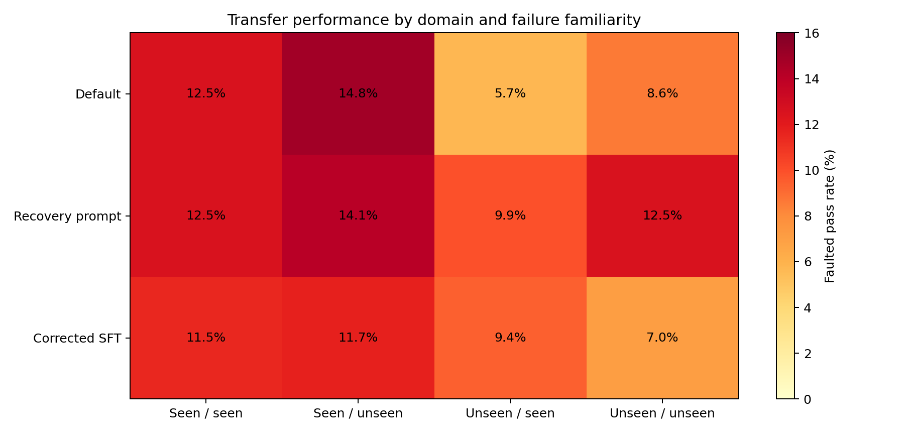
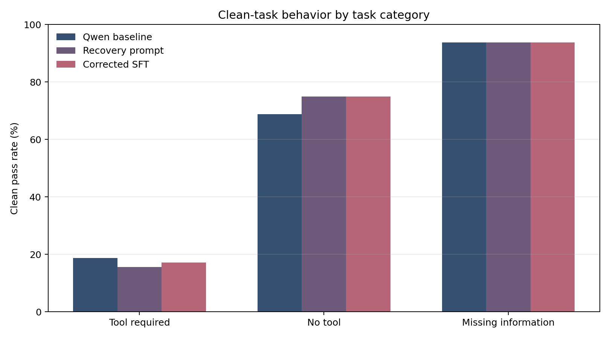

# TCRB v0.2 Study Report

## Summary

TCRB v0.2 tests whether a small tool-using language model can recover when a tool returns a bad result. The study compares the same Qwen3-4B model under three conditions:

1. The normal system instructions.
2. A recovery prompt that explains how to respond to tool failures.
3. Supervised fine-tuning (SFT), where the model is shown recovery examples.

The recovery prompt is the strongest completed intervention. It raises faulted-task accuracy from 10.16% to 12.03% while reducing clean-task accuracy from 31.25% to 29.38%. Corrected SFT removes an earlier formatting failure but does not improve over the prompt-only condition.

This is a measurement and failure-analysis result, not evidence that DPO or SFT improves reliability yet.

## Research Questions

- How often does a compact model use tools correctly before failures are introduced?
- Which tool failures cause the largest reliability loss?
- Does an explicit recovery policy improve behavior without harming normal tasks?
- Does supervised training transfer from seen domains and hazards to unseen ones?
- Does the improvement survive when faults are actually applied to the model's chosen tool?

## Benchmark Design

The benchmark contains 160 tasks across customer support, ecommerce, fintech, and developer tools. Each task has a user query, available tools, an oracle action sequence, and required answer claims.

There are three task categories:

- `tool_required`: a valid tool call and evidence-based answer are required.
- `no_tool`: the model should answer without calling a tool.
- `missing_information`: the model should ask for clarification.

There are 128 tool-required tasks. Each receives five fault variants, producing 640 faulted episodes in addition to the 160 clean episodes.

The five fault types are:

- `execution_error`: the service returns an error such as HTTP 503.
- `schema_drift`: expected fields disappear or unexpected fields appear.
- `partial_output`: only part of the requested result is returned.
- `silent_corruption`: the service reports success but returns a wrong value.
- `cross_source_conflict`: two sources report contradictory values.

Training data uses only the 48 train tasks from customer support and ecommerce, plus execution errors, schema drift, and partial output. Silent corruption and cross-source conflict are held out as unseen hazards. Fintech and developer tools are held out as unseen domains.

## Evaluation

The model generates one structured JSON action at each step. A task passes only when its category-specific behavior is correct:

- Tool-required tasks need the required claims and a valid tool sequence.
- No-tool tasks must not call a tool and must contain the required claims.
- Missing-information tasks must produce a clarification.

Faulted accuracy and applied-fault recovery are reported separately. A scheduled fault is only applied if the model calls the scheduled target tool. This distinction prevents a model from receiving recovery credit for a fault it never encountered.

All completed runs use Qwen3-4B, native Hugging Face generation, seed 42, and one Kaggle Nvidia T4. Gemini was not used.

## Main Results

| Condition | Clean | Faulted | Applied faults | Applied recovery |
|---|---:|---:|---:|---:|
| Default baseline | 50/160 (31.25%) | 65/640 (10.16%) | 204 | 65/204 (31.86%) |
| Recovery prompt | 47/160 (29.38%) | 77/640 (12.03%) | 236 | 77/236 (32.63%) |
| Corrected SFT | 49/160 (30.63%) | 64/640 (10.00%) | 242 | 64/242 (26.45%) |

The recovery prompt improves faulted accuracy by 1.87 percentage points over the default baseline. It also reduces clean accuracy by 1.87 points.

Corrected SFT is close to the default baseline on clean tasks, but it does not match the recovery prompt on faulted tasks. Its execution-error result improves over the default baseline, but its overall recovery rate is lower.

## Hazard Results

| Hazard | Default | Recovery prompt | Corrected SFT |
|---|---:|---:|---:|
| Execution error | 1/41 applied | 14/51 applied | 6/52 applied |
| Schema drift | 20/40 applied | 18/44 applied | 18/46 applied |
| Partial output | 14/42 applied | 11/46 applied | 16/47 applied |
| Silent corruption | 16/40 applied | 20/48 applied | 14/48 applied |
| Cross-source conflict | 14/41 applied | 14/47 applied | 10/49 applied |

Execution errors are the clearest baseline weakness. The recovery prompt helps most on this hazard. The held-out hazards do not show a uniform transfer improvement.

## Transfer Results

| Quadrant | Default | Recovery prompt | Corrected SFT |
|---|---:|---:|---:|
| Seen domain / seen hazard | 24/192 (12.50%) | 24/192 (12.50%) | 22/192 (11.46%) |
| Seen domain / unseen hazard | 19/128 (14.84%) | 18/128 (14.06%) | 15/128 (11.72%) |
| Unseen domain / seen hazard | 11/192 (5.73%) | 19/192 (9.90%) | 18/192 (9.38%) |
| Unseen domain / unseen hazard | 11/128 (8.59%) | 16/128 (12.50%) | 9/128 (7.03%) |

The recovery prompt improves unseen-domain performance in this one-seed study. Corrected SFT does not preserve that gain.

## Iteration History

The first evaluator accepted generic final answers too easily. We changed scoring to require answer claims, category-specific behavior, and valid tool sequences.

The first structured-agent smoke run exposed a `BatchEncoding` handling error and a missing `Abort` import. We fixed both before the full baseline.

Faults initially targeted the wrong identity field. Fault scheduling was changed to target the actual scheduled tool name and to record whether the fault was applied.

The first recovery dataset was built from successful model traces. It produced only 24 useful rows and no execution-error examples. We replaced it with 144 oracle-derived rows: 48 rows for each training hazard.

The first SFT adapter was trained on text formatted differently from the native evaluation messages. Its traces contained many invalid-action aborts. The SFT pipeline now renders messages through the model tokenizer's native chat template and uses the same system/user/tool-result structure as evaluation.

Long Kaggle jobs were externally cancelled twice. Incremental result saving and task-offset resume support preserved completed work and allowed the missing suffix to be evaluated separately.

## Limitations

- Results use one seed. Multi-seed replication is required for a strong statistical claim.
- The evaluator checks required text claims, not full semantic equivalence.
- Applied-fault coverage varies because the model may skip or misroute the target tool.
- Oracle recovery examples mostly teach one-step retry behavior.
- The study uses one compact model and one GPU environment.
- DPO was not completed and Gemini was not evaluated.

## Recommended Paper Claim

The defensible claim is:

> In a controlled tool-failure benchmark, explicit recovery instructions improved faulted-task performance and transfer for a compact model, while supervised fine-tuning required strict chat-format alignment and did not improve over the prompt-only intervention in the completed one-seed study.

The next research step is multi-seed replication of the default and recovery-prompt conditions, followed by DPO or Gemini only as separate, clearly labeled experiments.

## Reproducibility

Compact machine-readable results are in [`results.json`](results.json). Figures are generated by:

```bash
python scripts/render_v02_report.py
```

The main implementation commits for this study are recorded in `results.json`. Kaggle was used for all model and adapter runs because the full native evaluation does not fit the local compute budget.

## Figures








